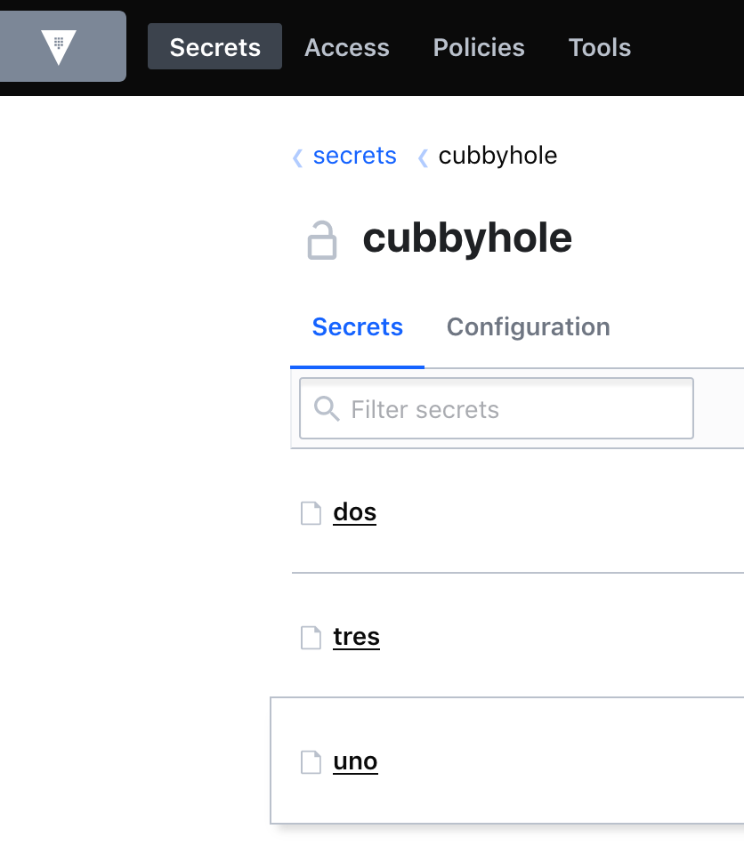
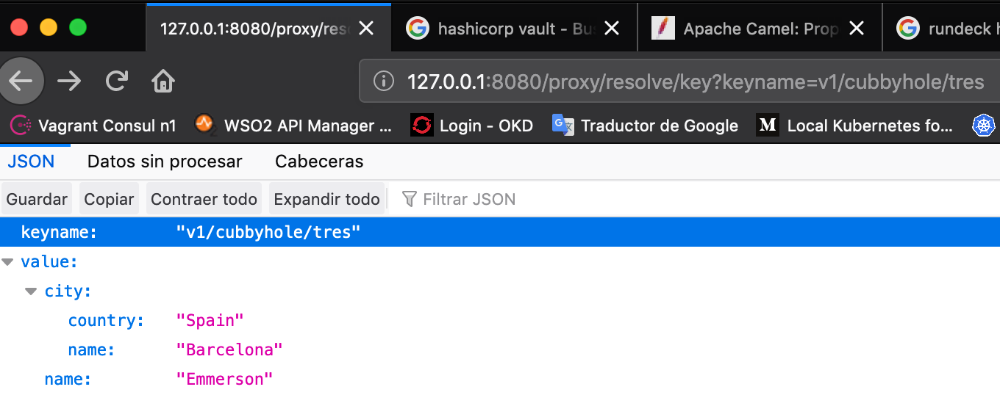

Camel Java8 Vault Client Project
==========================

Camel Java8 Router Project to access secrets storage into Hashicorp Vault. 

This is a Maven project with a simple example how to call Vault Rest API and get secrets using Apache Camel and Undertow component.

Communication Flow
------------------
Command Line (curl) ---> Camel-Vault-Client  --> Hashicorp Vault


Environment Parameters
------------------
You must have two environment variables in order to connect with Vault, one is for URL and another the access Token.

Mind the URL and Token values in this document are examples.

```
export PARAM_VAULT_URL=http://127.0.0.1:8200
export PARAM_VAULT_TOKEN=s.vvMr4cJCBT8rccg6Z5DfCuZK
```

Setting up secrets in Hashicorp Vault
------------------
For this example I setup some secrets in Vault as per below image.




Hashicorp Vault REST API Examples
------------------
Below you will find some examples how to get secrets from Hashicorp Vault using curl command line.

```
$ curl --header "X-Vault-Token: $VAULT_TOKEN" http://127.0.0.1:8200/v1/cubbyhole/uno
{"request_id":"c5ee7fd0-ca69-d6d1-493c-10930a1df67e","lease_id":"","renewable":false,"lease_duration":0,"data":{"1":"uno"},"wrap_info":null,"warnings":null,"auth":null}
```

```
$ curl --header "X-Vault-Token: $VAULT_TOKEN" http://127.0.0.1:8200/v1/cubbyhole/dos
{"request_id":"b80b804d-f461-5021-ceea-6ee9ad59b543","lease_id":"","renewable":false,"lease_duration":0,"data":{"password":"dos-2","username":"dos-1"},"wrap_info":null,"warnings":null,"auth":null}
```

```
$ curl --header "X-Vault-Token: $VAULT_TOKEN" http://127.0.0.1:8200/v1/cubbyhole/tres
{"request_id":"24fca9b6-af6a-700f-2481-f096fd2ed9ea","lease_id":"","renewable":false,"lease_duration":0,"data":{"city":{"country":"Spain","name":"Barcelona"},"name":"Emmerson"},"wrap_info":null,"warnings":null,"auth":null}
```

```
$ curl --header "X-Vault-Token: $VAULT_TOKEN" http://127.0.0.1:8200/v1/cubbyhole/mistake
{"errors":[]}
```


Testing Camel-Vault-Client Project
------------------

Calling microservice from command line.

```
$ curl http://127.0.0.1:8080/proxy/resolve/key?keyname=v1/cubbyhole/uno
{"keyname":"v1/cubbyhole/uno","value":{"1":"uno"}}
```

```
$ curl http://127.0.0.1:8080/proxy/resolve/key?keyname=v1/cubbyhole/dos
{"keyname":"v1/cubbyhole/dos","value":{"password":"dos-2","username":"dos-1"}}
```

```
$ curl http://127.0.0.1:8080/proxy/resolve/key?keyname=v1/cubbyhole/tres
{"keyname":"v1/cubbyhole/tres","value":{"city":{"country":"Spain","name":"Barcelona"},"name":"Emmerson"}}
```

```
$ curl http://127.0.0.1:8080/proxy/resolve/key?keyname=v1/cubbyhole/mistake
{"keyname":"v1/cubbyhole/mistake","error":"HTTP operation failed invoking http://127.0.0.1:8200/ with statusCode: 404"}
```


However you can can always your browser :-)




More info
===========

*   https://learn.hashicorp.com/vault/getting-started/apis


