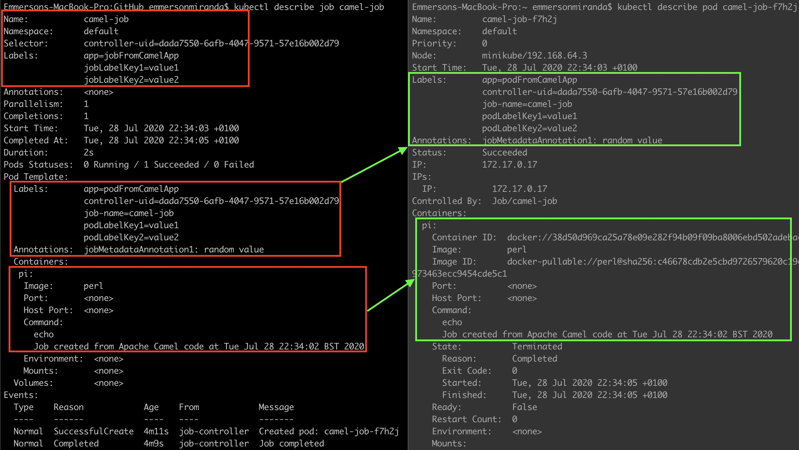

Camel CDI - Kubernetes Examples
================================

This example shows how to work with Camel CDI to configure [Kubernetes components](https://camel.apache.org/components/latest/kubernetes-summary.html "Kubernetes components").

## Configuration

You have to introduce master server's IP/port and OAuth token in order to connect with kubernetes in the application.properties file.

Find out more https://kubernetes.io/docs/tasks/administer-cluster/access-cluster-api/

## Examples

The implementation of this POC -don't pretend to show best practices- run the Camel Routes few seconds after Camel starts to:

* List pods (KubernetesListJob class)
* List jobs (KubernetesListJob class)
* Create a job (KubernetesCreateJob class)

** Create job **

Below image show the annotations, labels and pod definition generated by the source code.

 

## Maven

You will need to compile this example first:
  mvn install

To run the example type
  mvn camel:run

