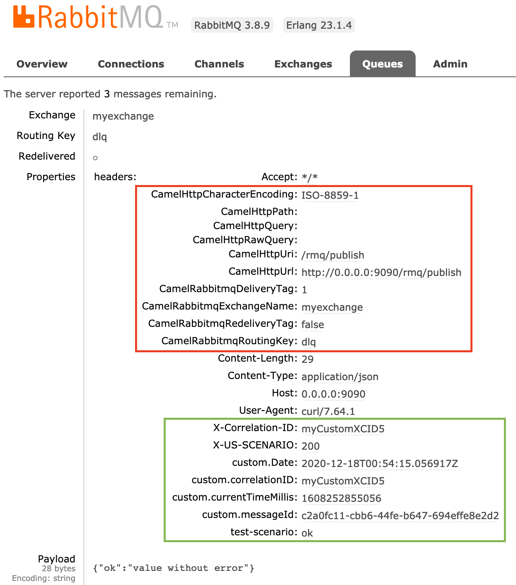

# Camel 3 CDI - RabbitMQ Consumer


This example get messages from RabbitMQ.


## RabbitMQ
More info at: https://hub.docker.com/_/rabbitmq

To start RabbitMQ server run;

```
docker run -d -p 15672:15672 -p 5672:5672 --hostname my-rabbit --name some-rabbit rabbitmq:3-management
```

## Testing

Publish instructing mock server respond 200

```
$ curl -d "{\"ok\": \"value without error\"}" -H "Content-Type: application/json" -H "X-Correlation-ID: myCustomXCID5" -H "test-scenario: ok" -H "X-US-SCENARIO: 200" -X POST http://0.0.0.0:9090/rmq/publish
```

Pay attention in below image, without filter the camel headers will end up in rabbitmq and cause troubles in the consumer if it uses HTTP component.
  


Publish instructing mock server respond 400

```
$ curl -d "{"ok": "value without error"}" -H "Content-Type: application/json" -H "X-Correlation-ID: myCustomXCID5" -H "test-scenario: ok" -H "X-US-SCENARIO: 400" -X POST http://0.0.0.0:9090/rmq/publish
```

Publish instructing mock server respond 500

```
$ curl -d "{"ok": "value without error"}" -H "Content-Type: application/json" -H "X-Correlation-ID: myCustomXCID5" -H "test-scenario: ok" -H "X-US-SCENARIO: 500" -X POST http://0.0.0.0:9090/rmq/publish
```

Stop consuming messages from queue

```
$ curl -d "{\"routeId\": \"myms.rmq.consumer.myqueue.routeid\", \"routingKey\": \"rabbit.consumer\", \"suspend\": \"true\"}" -H "Content-Type: application/json"  -X POST http://0.0.0.0:9090/mngt/publish
```

Stop consuming messages from queue for some period of time

```
$ curl -d "{\"routeId\": \"myms.rmq.consumer.myqueue.routeid\", \"routingKey\": \"rabbit.consumer\", \"suspend\": \"true\", \"restartDelay\": \"15000\"}" -H "Content-Type: application/json"  -X POST http://0.0.0.0:9090/mngt/publish
```

Start consuming messages from queue

```
$ curl -d "{\"routeId\": \"myms.rmq.consumer.myqueue.routeid\", \"routingKey\": \"rabbit.consumer\", \"suspend\": \"false\"}" -H "Content-Type: application/json"  -X POST http://0.0.0.0:9090/mngt/publish
```

Stop camel HTTP endpoint consumer indefinitely

```
curl -d "{\"routeId\": \"mngt-endpoint-stats\", \"routingKey\": \"rabbit.consumer\", \"suspend\": \"true\"}" -H "Content-Type: application/json"  -X POST http://0.0.0.0:9090/mngt/publish

curl -i http://0.0.0.0:9090/mngt/stats
```

Start camel HTTP endpoint consumer indefinitely

```
curl -d "{\"routeId\": \"mngt-endpoint-stats\", \"routingKey\": \"rabbit.consumer\", \"suspend\": \"false\"}" -H "Content-Type: application/json"  -X POST http://0.0.0.0:9090/mngt/publish

curl -i http://0.0.0.0:9090/mngt/stats
```

Stop camel HTTP endpoint consumer for some period of time

```
curl -d "{\"routeId\": \"mngt-endpoint-stats\", \"routingKey\": \"rabbit.consumer\", \"suspend\": \"true\", \"restartDelay\": \"15000\"}" -H "Content-Type: application/json"  -X POST http://0.0.0.0:9090/mngt/publish

curl -i http://0.0.0.0:9090/mngt/stats
```

Describe camel routes

```
$ curl http://0.0.0.0:9090/mngt/describe | jq .

{
  "date": "2020-04-22T23:47:37.386Z",
  "routes": {
    "mngt.controlbus.consumer.amqp": "RabbitMQEndpoint",
    "mngt.controlbus.consumer.direct": "DirectEndpoint",
    "mngt.controlbus.describe.direct": "DirectEndpoint",
    "mngt.controlbus.describe.get": "RestEndpoint",
    "mngt.controlbus.producer.direct": "DirectEndpoint",
    "mngt.controlbus.producer.post": "RestEndpoint",
    "mngt.controlbus.shutdown.direct": "DirectEndpoint",
    "mngt.controlbus.shutdown.get": "RestEndpoint",
    "mngt.controlbus.swagger.get": "RestApiEndpoint",
    "ms.mymscode.myqueuename.amqp.consumer": "RabbitMQEndpoint",
    "ms.mymscode.myqueuename.camel.direct": "DirectEndpoint",
    "ms.mymscode.stats.camel.direct": "DirectEndpoint",
    "ms.mymscode.stats.http.get": "RestEndpoint"
  }
}
```


Gracefull shudown

```
$ curl http://0.0.0.0:9090/mngt/shutdown
```

## Related projects
Camel 3 CDI - RabbitMQ Producer

## Prometheus Integration

External info 

* https://github.com/prometheus
* https://github.com/prometheus/jmx_exporter
* https://prometheus.io/docs/instrumenting/writing_exporters/
* https://github.com/prometheus/jmx_exporter/blob/master/jmx_prometheus_javaagent/src/main/java/io/prometheus/jmx/JavaAgent.java
* http://www.opensourcerers.org/2017/11/29/monitoring-camel-prometheus-red-hat-openshift/

Help from Apache Camel Members (thank you guys)

* https://issues.apache.org/jira/browse/CAMEL-14930
* https://issues.apache.org/jira/browse/CAMEL-14944


Prometheus agent config.yaml

```
- pattern: 'MyMetrics<name=(.*), type=(.*)><>(.*):(.*)'
  name: camel3_$1_$3
  help: $1-$3 [milliseconds]
  type: GAUGE
  labels:
    type: $2
    journey: $1
    propname: $3
```


Start the microservice with prometheus agent

```
-javaagent:./prometheus/jmx_prometheus_javaagent-0.12.0.jar=8888:./prometheus/config.yaml
```

Output of call http://localhost:8888/

```
# HELP jvm_gc_collection_seconds Time spent in a given JVM garbage collector in seconds.
# TYPE jvm_gc_collection_seconds summary
jvm_gc_collection_seconds_count{gc="PS Scavenge",} 5.0
jvm_gc_collection_seconds_sum{gc="PS Scavenge",} 0.029
jvm_gc_collection_seconds_count{gc="PS MarkSweep",} 2.0
jvm_gc_collection_seconds_sum{gc="PS MarkSweep",} 0.094
# HELP jmx_config_reload_failure_total Number of times configuration have failed to be reloaded.
# TYPE jmx_config_reload_failure_total counter
jmx_config_reload_failure_total 0.0
# HELP camel3_myms_rest_get_status_routeid_stddev myms.rest.get.status.routeid-StdDev [milliseconds]
# TYPE camel3_myms_rest_get_status_routeid_stddev gauge
camel3_myms_rest_get_status_routeid_stddev{journey="myms.rest.get.status.routeid",propname="StdDev",type="timers",} 0.0
# HELP camel3_mngt_rest_post_producer_routeid_fifteenminuterate mngt.rest.post.producer.routeid-FifteenMinuteRate [milliseconds]
# TYPE camel3_mngt_rest_post_producer_routeid_fifteenminuterate gauge
camel3_mngt_rest_post_producer_routeid_fifteenminuterate{journey="mngt.rest.post.producer.routeid",propname="FifteenMinuteRate",type="timers",} 0.0
# HELP camel3_mngt_rest_post_producer_routeid_meanrate mngt.rest.post.producer.routeid-MeanRate [milliseconds]
# TYPE camel3_mngt_rest_post_producer_routeid_meanrate gauge
camel3_mngt_rest_post_producer_routeid_meanrate{journey="mngt.rest.post.producer.routeid",propname="MeanRate",type="timers",} 0.0
# HELP camel3_myms_rest_get_status_routeid_fiveminuterate myms.rest.get.status.routeid-FiveMinuteRate [milliseconds]
# TYPE camel3_myms_rest_get_status_routeid_fiveminuterate gauge
camel3_myms_rest_get_status_routeid_fiveminuterate{journey="myms.rest.get.status.routeid",propname="FiveMinuteRate",type="timers",} 0.0
# HELP camel3_myms_rest_get_status_routeid_fifteenminuterate myms.rest.get.status.routeid-FifteenMinuteRate [milliseconds]
# TYPE camel3_myms_rest_get_status_routeid_fifteenminuterate gauge
camel3_myms_rest_get_status_routeid_fifteenminuterate{journey="myms.rest.get.status.routeid",propname="FifteenMinuteRate",type="timers",} 0.0
# HELP camel3_myms_rest_get_status_routeid_999thpercentile myms.rest.get.status.routeid-999thPercentile [milliseconds]
# TYPE camel3_myms_rest_get_status_routeid_999thpercentile gauge
camel3_myms_rest_get_status_routeid_999thpercentile{journey="myms.rest.get.status.routeid",propname="999thPercentile",type="timers",} 0.0
# HELP camel3_myms_rest_get_status_routeid_50thpercentile myms.rest.get.status.routeid-50thPercentile [milliseconds]
# TYPE camel3_myms_rest_get_status_routeid_50thpercentile gauge
camel3_myms_rest_get_status_routeid_50thpercentile{journey="myms.rest.get.status.routeid",propname="50thPercentile",type="timers",} 0.0
# HELP camel3_mngt_rmq_consumer_controlbus_routeid_99thpercentile mngt.rmq.consumer.controlbus.routeid-99thPercentile [milliseconds]
# TYPE camel3_mngt_rmq_consumer_controlbus_routeid_99thpercentile gauge
camel3_mngt_rmq_consumer_controlbus_routeid_99thpercentile{journey="mngt.rmq.consumer.controlbus.routeid",propname="99thPercentile",type="timers",} 0.0
# HELP camel3_mngt_rmq_consumer_controlbus_routeid_count mngt.rmq.consumer.controlbus.routeid-Count [milliseconds]
# TYPE camel3_mngt_rmq_consumer_controlbus_routeid_count gauge
camel3_mngt_rmq_consumer_controlbus_routeid_count{journey="mngt.rmq.consumer.controlbus.routeid",propname="Count",type="timers",} 0.0
# HELP camel3_myms_rest_get_status_routeid_mean myms.rest.get.status.routeid-Mean [milliseconds]
# TYPE camel3_myms_rest_get_status_routeid_mean gauge
camel3_myms_rest_get_status_routeid_mean{journey="myms.rest.get.status.routeid",propname="Mean",type="timers",} 0.0
# HELP camel3_mngt_rmq_consumer_controlbus_routeid_min mngt.rmq.consumer.controlbus.routeid-Min [milliseconds]
# TYPE camel3_mngt_rmq_consumer_controlbus_routeid_min gauge
camel3_mngt_rmq_consumer_controlbus_routeid_min{journey="mngt.rmq.consumer.controlbus.routeid",propname="Min",type="timers",} 0.0
# HELP camel3_myms_rmq_consumer_myqueue_routeid_meanrate myms.rmq.consumer.myqueue.routeid-MeanRate [milliseconds]
# TYPE camel3_myms_rmq_consumer_myqueue_routeid_meanrate gauge
camel3_myms_rmq_consumer_myqueue_routeid_meanrate{journey="myms.rmq.consumer.myqueue.routeid",propname="MeanRate",type="timers",} 0.0
# HELP camel3_mngt_rest_post_producer_routeid_50thpercentile mngt.rest.post.producer.routeid-50thPercentile [milliseconds]
# TYPE camel3_mngt_rest_post_producer_routeid_50thpercentile gauge
camel3_mngt_rest_post_producer_routeid_50thpercentile{journey="mngt.rest.post.producer.routeid",propname="50thPercentile",type="timers",} 0.0
# HELP camel3_mngt_rest_post_producer_routeid_max mngt.rest.post.producer.routeid-Max [milliseconds]
# TYPE camel3_mngt_rest_post_producer_routeid_max gauge
camel3_mngt_rest_post_producer_routeid_max{journey="mngt.rest.post.producer.routeid",propname="Max",type="timers",} 0.0
# HELP camel3_myms_rmq_consumer_myqueue_routeid_98thpercentile myms.rmq.consumer.myqueue.routeid-98thPercentile [milliseconds]
# TYPE camel3_myms_rmq_consumer_myqueue_routeid_98thpercentile gauge
camel3_myms_rmq_consumer_myqueue_routeid_98thpercentile{journey="myms.rmq.consumer.myqueue.routeid",propname="98thPercentile",type="timers",} 0.0
# HELP camel3_mngt_rmq_consumer_controlbus_routeid_oneminuterate mngt.rmq.consumer.controlbus.routeid-OneMinuteRate [milliseconds]
# TYPE camel3_mngt_rmq_consumer_controlbus_routeid_oneminuterate gauge
camel3_mngt_rmq_consumer_controlbus_routeid_oneminuterate{journey="mngt.rmq.consumer.controlbus.routeid",propname="OneMinuteRate",type="timers",} 0.0
# HELP camel3_myms_rmq_consumer_myqueue_routeid_99thpercentile myms.rmq.consumer.myqueue.routeid-99thPercentile [milliseconds]
# TYPE camel3_myms_rmq_consumer_myqueue_routeid_99thpercentile gauge
camel3_myms_rmq_consumer_myqueue_routeid_99thpercentile{journey="myms.rmq.consumer.myqueue.routeid",propname="99thPercentile",type="timers",} 0.0
# HELP camel3_myms_rmq_consumer_myqueue_routeid_stddev myms.rmq.consumer.myqueue.routeid-StdDev [milliseconds]
# TYPE camel3_myms_rmq_consumer_myqueue_routeid_stddev gauge
camel3_myms_rmq_consumer_myqueue_routeid_stddev{journey="myms.rmq.consumer.myqueue.routeid",propname="StdDev",type="timers",} 0.0
# HELP camel3_myms_rmq_consumer_myqueue_routeid_oneminuterate myms.rmq.consumer.myqueue.routeid-OneMinuteRate [milliseconds]
# TYPE camel3_myms_rmq_consumer_myqueue_routeid_oneminuterate gauge
camel3_myms_rmq_consumer_myqueue_routeid_oneminuterate{journey="myms.rmq.consumer.myqueue.routeid",propname="OneMinuteRate",type="timers",} 0.0
# HELP camel3_myms_rest_get_status_routeid_count myms.rest.get.status.routeid-Count [milliseconds]
# TYPE camel3_myms_rest_get_status_routeid_count gauge
camel3_myms_rest_get_status_routeid_count{journey="myms.rest.get.status.routeid",propname="Count",type="timers",} 0.0
# HELP camel3_mngt_rmq_consumer_controlbus_routeid_999thpercentile mngt.rmq.consumer.controlbus.routeid-999thPercentile [milliseconds]
# TYPE camel3_mngt_rmq_consumer_controlbus_routeid_999thpercentile gauge
camel3_mngt_rmq_consumer_controlbus_routeid_999thpercentile{journey="mngt.rmq.consumer.controlbus.routeid",propname="999thPercentile",type="timers",} 0.0
# HELP camel3_mngt_rmq_consumer_controlbus_routeid_max mngt.rmq.consumer.controlbus.routeid-Max [milliseconds]
# TYPE camel3_mngt_rmq_consumer_controlbus_routeid_max gauge
camel3_mngt_rmq_consumer_controlbus_routeid_max{journey="mngt.rmq.consumer.controlbus.routeid",propname="Max",type="timers",} 0.0
# HELP camel3_myms_rmq_consumer_myqueue_routeid_50thpercentile myms.rmq.consumer.myqueue.routeid-50thPercentile [milliseconds]
# TYPE camel3_myms_rmq_consumer_myqueue_routeid_50thpercentile gauge
camel3_myms_rmq_consumer_myqueue_routeid_50thpercentile{journey="myms.rmq.consumer.myqueue.routeid",propname="50thPercentile",type="timers",} 0.0
# HELP camel3_myms_rmq_consumer_myqueue_routeid_75thpercentile myms.rmq.consumer.myqueue.routeid-75thPercentile [milliseconds]
# TYPE camel3_myms_rmq_consumer_myqueue_routeid_75thpercentile gauge
camel3_myms_rmq_consumer_myqueue_routeid_75thpercentile{journey="myms.rmq.consumer.myqueue.routeid",propname="75thPercentile",type="timers",} 0.0
# HELP camel3_mngt_rest_post_producer_routeid_min mngt.rest.post.producer.routeid-Min [milliseconds]
# TYPE camel3_mngt_rest_post_producer_routeid_min gauge
camel3_mngt_rest_post_producer_routeid_min{journey="mngt.rest.post.producer.routeid",propname="Min",type="timers",} 0.0
# HELP camel3_mngt_rmq_consumer_controlbus_routeid_meanrate mngt.rmq.consumer.controlbus.routeid-MeanRate [milliseconds]
# TYPE camel3_mngt_rmq_consumer_controlbus_routeid_meanrate gauge
camel3_mngt_rmq_consumer_controlbus_routeid_meanrate{journey="mngt.rmq.consumer.controlbus.routeid",propname="MeanRate",type="timers",} 0.0
# HELP camel3_myms_rmq_consumer_myqueue_routeid_95thpercentile myms.rmq.consumer.myqueue.routeid-95thPercentile [milliseconds]
# TYPE camel3_myms_rmq_consumer_myqueue_routeid_95thpercentile gauge
camel3_myms_rmq_consumer_myqueue_routeid_95thpercentile{journey="myms.rmq.consumer.myqueue.routeid",propname="95thPercentile",type="timers",} 0.0
# HELP camel3_myms_rmq_consumer_myqueue_routeid_fiveminuterate myms.rmq.consumer.myqueue.routeid-FiveMinuteRate [milliseconds]
# TYPE camel3_myms_rmq_consumer_myqueue_routeid_fiveminuterate gauge
camel3_myms_rmq_consumer_myqueue_routeid_fiveminuterate{journey="myms.rmq.consumer.myqueue.routeid",propname="FiveMinuteRate",type="timers",} 0.0
# HELP camel3_myms_rest_get_status_routeid_min myms.rest.get.status.routeid-Min [milliseconds]
# TYPE camel3_myms_rest_get_status_routeid_min gauge
camel3_myms_rest_get_status_routeid_min{journey="myms.rest.get.status.routeid",propname="Min",type="timers",} 0.0
# HELP camel3_mngt_rest_post_producer_routeid_count mngt.rest.post.producer.routeid-Count [milliseconds]
# TYPE camel3_mngt_rest_post_producer_routeid_count gauge
camel3_mngt_rest_post_producer_routeid_count{journey="mngt.rest.post.producer.routeid",propname="Count",type="timers",} 0.0
# HELP camel3_mngt_rest_post_producer_routeid_oneminuterate mngt.rest.post.producer.routeid-OneMinuteRate [milliseconds]
# TYPE camel3_mngt_rest_post_producer_routeid_oneminuterate gauge
camel3_mngt_rest_post_producer_routeid_oneminuterate{journey="mngt.rest.post.producer.routeid",propname="OneMinuteRate",type="timers",} 0.0
# HELP camel3_myms_rmq_consumer_myqueue_routeid_mean myms.rmq.consumer.myqueue.routeid-Mean [milliseconds]
# TYPE camel3_myms_rmq_consumer_myqueue_routeid_mean gauge
camel3_myms_rmq_consumer_myqueue_routeid_mean{journey="myms.rmq.consumer.myqueue.routeid",propname="Mean",type="timers",} 0.0
# HELP camel3_myms_rmq_consumer_myqueue_routeid_count myms.rmq.consumer.myqueue.routeid-Count [milliseconds]
# TYPE camel3_myms_rmq_consumer_myqueue_routeid_count gauge
camel3_myms_rmq_consumer_myqueue_routeid_count{journey="myms.rmq.consumer.myqueue.routeid",propname="Count",type="timers",} 0.0
# HELP camel3_mngt_rmq_consumer_controlbus_routeid_mean mngt.rmq.consumer.controlbus.routeid-Mean [milliseconds]
# TYPE camel3_mngt_rmq_consumer_controlbus_routeid_mean gauge
camel3_mngt_rmq_consumer_controlbus_routeid_mean{journey="mngt.rmq.consumer.controlbus.routeid",propname="Mean",type="timers",} 0.0
# HELP camel3_mngt_rest_post_producer_routeid_95thpercentile mngt.rest.post.producer.routeid-95thPercentile [milliseconds]
# TYPE camel3_mngt_rest_post_producer_routeid_95thpercentile gauge
camel3_mngt_rest_post_producer_routeid_95thpercentile{journey="mngt.rest.post.producer.routeid",propname="95thPercentile",type="timers",} 0.0
# HELP camel3_mngt_rest_post_producer_routeid_stddev mngt.rest.post.producer.routeid-StdDev [milliseconds]
# TYPE camel3_mngt_rest_post_producer_routeid_stddev gauge
camel3_mngt_rest_post_producer_routeid_stddev{journey="mngt.rest.post.producer.routeid",propname="StdDev",type="timers",} 0.0
# HELP camel3_mngt_rmq_consumer_controlbus_routeid_fiveminuterate mngt.rmq.consumer.controlbus.routeid-FiveMinuteRate [milliseconds]
# TYPE camel3_mngt_rmq_consumer_controlbus_routeid_fiveminuterate gauge
camel3_mngt_rmq_consumer_controlbus_routeid_fiveminuterate{journey="mngt.rmq.consumer.controlbus.routeid",propname="FiveMinuteRate",type="timers",} 0.0
# HELP camel3_mngt_rest_post_producer_routeid_75thpercentile mngt.rest.post.producer.routeid-75thPercentile [milliseconds]
# TYPE camel3_mngt_rest_post_producer_routeid_75thpercentile gauge
camel3_mngt_rest_post_producer_routeid_75thpercentile{journey="mngt.rest.post.producer.routeid",propname="75thPercentile",type="timers",} 0.0
# HELP camel3_myms_rest_get_status_routeid_meanrate myms.rest.get.status.routeid-MeanRate [milliseconds]
# TYPE camel3_myms_rest_get_status_routeid_meanrate gauge
camel3_myms_rest_get_status_routeid_meanrate{journey="myms.rest.get.status.routeid",propname="MeanRate",type="timers",} 0.0
# HELP camel3_mngt_rest_post_producer_routeid_99thpercentile mngt.rest.post.producer.routeid-99thPercentile [milliseconds]
# TYPE camel3_mngt_rest_post_producer_routeid_99thpercentile gauge
camel3_mngt_rest_post_producer_routeid_99thpercentile{journey="mngt.rest.post.producer.routeid",propname="99thPercentile",type="timers",} 0.0
# HELP camel3_mngt_rest_post_producer_routeid_98thpercentile mngt.rest.post.producer.routeid-98thPercentile [milliseconds]
# TYPE camel3_mngt_rest_post_producer_routeid_98thpercentile gauge
camel3_mngt_rest_post_producer_routeid_98thpercentile{journey="mngt.rest.post.producer.routeid",propname="98thPercentile",type="timers",} 0.0
# HELP camel3_myms_rmq_consumer_myqueue_routeid_max myms.rmq.consumer.myqueue.routeid-Max [milliseconds]
# TYPE camel3_myms_rmq_consumer_myqueue_routeid_max gauge
camel3_myms_rmq_consumer_myqueue_routeid_max{journey="myms.rmq.consumer.myqueue.routeid",propname="Max",type="timers",} 0.0
# HELP camel3_myms_rest_get_status_routeid_98thpercentile myms.rest.get.status.routeid-98thPercentile [milliseconds]
# TYPE camel3_myms_rest_get_status_routeid_98thpercentile gauge
camel3_myms_rest_get_status_routeid_98thpercentile{journey="myms.rest.get.status.routeid",propname="98thPercentile",type="timers",} 0.0
# HELP camel3_myms_rest_get_status_routeid_99thpercentile myms.rest.get.status.routeid-99thPercentile [milliseconds]
# TYPE camel3_myms_rest_get_status_routeid_99thpercentile gauge
camel3_myms_rest_get_status_routeid_99thpercentile{journey="myms.rest.get.status.routeid",propname="99thPercentile",type="timers",} 0.0
# HELP camel3_myms_rmq_consumer_myqueue_routeid_fifteenminuterate myms.rmq.consumer.myqueue.routeid-FifteenMinuteRate [milliseconds]
# TYPE camel3_myms_rmq_consumer_myqueue_routeid_fifteenminuterate gauge
camel3_myms_rmq_consumer_myqueue_routeid_fifteenminuterate{journey="myms.rmq.consumer.myqueue.routeid",propname="FifteenMinuteRate",type="timers",} 0.0
# HELP camel3_mngt_rest_post_producer_routeid_fiveminuterate mngt.rest.post.producer.routeid-FiveMinuteRate [milliseconds]
# TYPE camel3_mngt_rest_post_producer_routeid_fiveminuterate gauge
camel3_mngt_rest_post_producer_routeid_fiveminuterate{journey="mngt.rest.post.producer.routeid",propname="FiveMinuteRate",type="timers",} 0.0
# HELP camel3_mngt_rmq_consumer_controlbus_routeid_stddev mngt.rmq.consumer.controlbus.routeid-StdDev [milliseconds]
# TYPE camel3_mngt_rmq_consumer_controlbus_routeid_stddev gauge
camel3_mngt_rmq_consumer_controlbus_routeid_stddev{journey="mngt.rmq.consumer.controlbus.routeid",propname="StdDev",type="timers",} 0.0
# HELP camel3_mngt_rmq_consumer_controlbus_routeid_95thpercentile mngt.rmq.consumer.controlbus.routeid-95thPercentile [milliseconds]
# TYPE camel3_mngt_rmq_consumer_controlbus_routeid_95thpercentile gauge
camel3_mngt_rmq_consumer_controlbus_routeid_95thpercentile{journey="mngt.rmq.consumer.controlbus.routeid",propname="95thPercentile",type="timers",} 0.0
# HELP camel3_myms_rest_get_status_routeid_75thpercentile myms.rest.get.status.routeid-75thPercentile [milliseconds]
# TYPE camel3_myms_rest_get_status_routeid_75thpercentile gauge
camel3_myms_rest_get_status_routeid_75thpercentile{journey="myms.rest.get.status.routeid",propname="75thPercentile",type="timers",} 0.0
# HELP camel3_myms_rest_get_status_routeid_95thpercentile myms.rest.get.status.routeid-95thPercentile [milliseconds]
# TYPE camel3_myms_rest_get_status_routeid_95thpercentile gauge
camel3_myms_rest_get_status_routeid_95thpercentile{journey="myms.rest.get.status.routeid",propname="95thPercentile",type="timers",} 0.0
# HELP camel3_mngt_rest_post_producer_routeid_mean mngt.rest.post.producer.routeid-Mean [milliseconds]
# TYPE camel3_mngt_rest_post_producer_routeid_mean gauge
camel3_mngt_rest_post_producer_routeid_mean{journey="mngt.rest.post.producer.routeid",propname="Mean",type="timers",} 0.0
# HELP camel3_mngt_rmq_consumer_controlbus_routeid_98thpercentile mngt.rmq.consumer.controlbus.routeid-98thPercentile [milliseconds]
# TYPE camel3_mngt_rmq_consumer_controlbus_routeid_98thpercentile gauge
camel3_mngt_rmq_consumer_controlbus_routeid_98thpercentile{journey="mngt.rmq.consumer.controlbus.routeid",propname="98thPercentile",type="timers",} 0.0
# HELP camel3_mngt_rmq_consumer_controlbus_routeid_fifteenminuterate mngt.rmq.consumer.controlbus.routeid-FifteenMinuteRate [milliseconds]
# TYPE camel3_mngt_rmq_consumer_controlbus_routeid_fifteenminuterate gauge
camel3_mngt_rmq_consumer_controlbus_routeid_fifteenminuterate{journey="mngt.rmq.consumer.controlbus.routeid",propname="FifteenMinuteRate",type="timers",} 0.0
# HELP camel3_mngt_rmq_consumer_controlbus_routeid_75thpercentile mngt.rmq.consumer.controlbus.routeid-75thPercentile [milliseconds]
# TYPE camel3_mngt_rmq_consumer_controlbus_routeid_75thpercentile gauge
camel3_mngt_rmq_consumer_controlbus_routeid_75thpercentile{journey="mngt.rmq.consumer.controlbus.routeid",propname="75thPercentile",type="timers",} 0.0
# HELP camel3_myms_rmq_consumer_myqueue_routeid_min myms.rmq.consumer.myqueue.routeid-Min [milliseconds]
# TYPE camel3_myms_rmq_consumer_myqueue_routeid_min gauge
camel3_myms_rmq_consumer_myqueue_routeid_min{journey="myms.rmq.consumer.myqueue.routeid",propname="Min",type="timers",} 0.0
# HELP camel3_myms_rest_get_status_routeid_max myms.rest.get.status.routeid-Max [milliseconds]
# TYPE camel3_myms_rest_get_status_routeid_max gauge
camel3_myms_rest_get_status_routeid_max{journey="myms.rest.get.status.routeid",propname="Max",type="timers",} 0.0
# HELP camel3_mngt_rest_post_producer_routeid_999thpercentile mngt.rest.post.producer.routeid-999thPercentile [milliseconds]
# TYPE camel3_mngt_rest_post_producer_routeid_999thpercentile gauge
camel3_mngt_rest_post_producer_routeid_999thpercentile{journey="mngt.rest.post.producer.routeid",propname="999thPercentile",type="timers",} 0.0
# HELP camel3_mngt_rmq_consumer_controlbus_routeid_50thpercentile mngt.rmq.consumer.controlbus.routeid-50thPercentile [milliseconds]
# TYPE camel3_mngt_rmq_consumer_controlbus_routeid_50thpercentile gauge
camel3_mngt_rmq_consumer_controlbus_routeid_50thpercentile{journey="mngt.rmq.consumer.controlbus.routeid",propname="50thPercentile",type="timers",} 0.0
# HELP camel3_myms_rest_get_status_routeid_oneminuterate myms.rest.get.status.routeid-OneMinuteRate [milliseconds]
# TYPE camel3_myms_rest_get_status_routeid_oneminuterate gauge
camel3_myms_rest_get_status_routeid_oneminuterate{journey="myms.rest.get.status.routeid",propname="OneMinuteRate",type="timers",} 0.0
# HELP camel3_myms_rmq_consumer_myqueue_routeid_999thpercentile myms.rmq.consumer.myqueue.routeid-999thPercentile [milliseconds]
# TYPE camel3_myms_rmq_consumer_myqueue_routeid_999thpercentile gauge
camel3_myms_rmq_consumer_myqueue_routeid_999thpercentile{journey="myms.rmq.consumer.myqueue.routeid",propname="999thPercentile",type="timers",} 0.0
# HELP jmx_scrape_duration_seconds Time this JMX scrape took, in seconds.
# TYPE jmx_scrape_duration_seconds gauge
jmx_scrape_duration_seconds 0.147863783
# HELP jmx_scrape_error Non-zero if this scrape failed.
# TYPE jmx_scrape_error gauge
jmx_scrape_error 0.0
# HELP jvm_info JVM version info
# TYPE jvm_info gauge
jvm_info{version="1.8.0_181-b13",vendor="Oracle Corporation",runtime="Java(TM) SE Runtime Environment",} 1.0
# HELP jmx_exporter_build_info A metric with a constant '1' value labeled with the version of the JMX exporter.
# TYPE jmx_exporter_build_info gauge
jmx_exporter_build_info{version="0.12.0",name="jmx_prometheus_javaagent",} 1.0
# HELP jmx_config_reload_success_total Number of times configuration have successfully been reloaded.
# TYPE jmx_config_reload_success_total counter
jmx_config_reload_success_total 0.0
# HELP jvm_threads_current Current thread count of a JVM
# TYPE jvm_threads_current gauge
jvm_threads_current 37.0
# HELP jvm_threads_daemon Daemon thread count of a JVM
# TYPE jvm_threads_daemon gauge
jvm_threads_daemon 19.0
# HELP jvm_threads_peak Peak thread count of a JVM
# TYPE jvm_threads_peak gauge
jvm_threads_peak 48.0
# HELP jvm_threads_started_total Started thread count of a JVM
# TYPE jvm_threads_started_total counter
jvm_threads_started_total 51.0
# HELP jvm_threads_deadlocked Cycles of JVM-threads that are in deadlock waiting to acquire object monitors or ownable synchronizers
# TYPE jvm_threads_deadlocked gauge
jvm_threads_deadlocked 0.0
# HELP jvm_threads_deadlocked_monitor Cycles of JVM-threads that are in deadlock waiting to acquire object monitors
# TYPE jvm_threads_deadlocked_monitor gauge
jvm_threads_deadlocked_monitor 0.0
# HELP jvm_buffer_pool_used_bytes Used bytes of a given JVM buffer pool.
# TYPE jvm_buffer_pool_used_bytes gauge
jvm_buffer_pool_used_bytes{pool="direct",} 24556.0
jvm_buffer_pool_used_bytes{pool="mapped",} 0.0
# HELP jvm_buffer_pool_capacity_bytes Bytes capacity of a given JVM buffer pool.
# TYPE jvm_buffer_pool_capacity_bytes gauge
jvm_buffer_pool_capacity_bytes{pool="direct",} 24556.0
jvm_buffer_pool_capacity_bytes{pool="mapped",} 0.0
# HELP jvm_buffer_pool_used_buffers Used buffers of a given JVM buffer pool.
# TYPE jvm_buffer_pool_used_buffers gauge
jvm_buffer_pool_used_buffers{pool="direct",} 2.0
jvm_buffer_pool_used_buffers{pool="mapped",} 0.0
# HELP jvm_memory_bytes_used Used bytes of a given JVM memory area.
# TYPE jvm_memory_bytes_used gauge
jvm_memory_bytes_used{area="heap",} 1.10569088E8
jvm_memory_bytes_used{area="nonheap",} 5.6266944E7
# HELP jvm_memory_bytes_committed Committed (bytes) of a given JVM memory area.
# TYPE jvm_memory_bytes_committed gauge
jvm_memory_bytes_committed{area="heap",} 5.43686656E8
jvm_memory_bytes_committed{area="nonheap",} 5.8294272E7
# HELP jvm_memory_bytes_max Max (bytes) of a given JVM memory area.
# TYPE jvm_memory_bytes_max gauge
jvm_memory_bytes_max{area="heap",} 7.635730432E9
jvm_memory_bytes_max{area="nonheap",} -1.0
# HELP jvm_memory_bytes_init Initial bytes of a given JVM memory area.
# TYPE jvm_memory_bytes_init gauge
jvm_memory_bytes_init{area="heap",} 5.36870912E8
jvm_memory_bytes_init{area="nonheap",} 2555904.0
# HELP jvm_memory_pool_bytes_used Used bytes of a given JVM memory pool.
# TYPE jvm_memory_pool_bytes_used gauge
jvm_memory_pool_bytes_used{pool="Code Cache",} 1.2297408E7
jvm_memory_pool_bytes_used{pool="Metaspace",} 3.870944E7
jvm_memory_pool_bytes_used{pool="Compressed Class Space",} 5260096.0
jvm_memory_pool_bytes_used{pool="PS Eden Space",} 9.5435304E7
jvm_memory_pool_bytes_used{pool="PS Survivor Space",} 0.0
jvm_memory_pool_bytes_used{pool="PS Old Gen",} 1.5133784E7
# HELP jvm_memory_pool_bytes_committed Committed bytes of a given JVM memory pool.
# TYPE jvm_memory_pool_bytes_committed gauge
jvm_memory_pool_bytes_committed{pool="Code Cache",} 1.2320768E7
jvm_memory_pool_bytes_committed{pool="Metaspace",} 4.0288256E7
jvm_memory_pool_bytes_committed{pool="Compressed Class Space",} 5685248.0
jvm_memory_pool_bytes_committed{pool="PS Eden Space",} 2.60046848E8
jvm_memory_pool_bytes_committed{pool="PS Survivor Space",} 2.2020096E7
jvm_memory_pool_bytes_committed{pool="PS Old Gen",} 2.61619712E8
# HELP jvm_memory_pool_bytes_max Max bytes of a given JVM memory pool.
# TYPE jvm_memory_pool_bytes_max gauge
jvm_memory_pool_bytes_max{pool="Code Cache",} 2.5165824E8
jvm_memory_pool_bytes_max{pool="Metaspace",} -1.0
jvm_memory_pool_bytes_max{pool="Compressed Class Space",} 1.073741824E9
jvm_memory_pool_bytes_max{pool="PS Eden Space",} 2.826960896E9
jvm_memory_pool_bytes_max{pool="PS Survivor Space",} 2.2020096E7
jvm_memory_pool_bytes_max{pool="PS Old Gen",} 5.726797824E9
# HELP jvm_memory_pool_bytes_init Initial bytes of a given JVM memory pool.
# TYPE jvm_memory_pool_bytes_init gauge
jvm_memory_pool_bytes_init{pool="Code Cache",} 2555904.0
jvm_memory_pool_bytes_init{pool="Metaspace",} 0.0
jvm_memory_pool_bytes_init{pool="Compressed Class Space",} 0.0
jvm_memory_pool_bytes_init{pool="PS Eden Space",} 1.34742016E8
jvm_memory_pool_bytes_init{pool="PS Survivor Space",} 2.2020096E7
jvm_memory_pool_bytes_init{pool="PS Old Gen",} 3.58088704E8
# HELP jvm_classes_loaded The number of classes that are currently loaded in the JVM
# TYPE jvm_classes_loaded gauge
jvm_classes_loaded 7186.0
# HELP jvm_classes_loaded_total The total number of classes that have been loaded since the JVM has started execution
# TYPE jvm_classes_loaded_total counter
jvm_classes_loaded_total 7186.0
# HELP jvm_classes_unloaded_total The total number of classes that have been unloaded since the JVM has started execution
# TYPE jvm_classes_unloaded_total counter
jvm_classes_unloaded_total 0.0
# HELP process_cpu_seconds_total Total user and system CPU time spent in seconds.
# TYPE process_cpu_seconds_total counter
process_cpu_seconds_total 7.588655
# HELP process_start_time_seconds Start time of the process since unix epoch in seconds.
# TYPE process_start_time_seconds gauge
process_start_time_seconds 1.587314933606E9
# HELP process_open_fds Number of open file descriptors.
# TYPE process_open_fds gauge
process_open_fds 167.0
# HELP process_max_fds Maximum number of open file descriptors.
# TYPE process_max_fds gauge
process_max_fds 10240.0

```

### JMX Console view

  


# Error handling

## Stack trace when connection is closed after get upstream response

```
[                  XNIO-1 I/O-1] direct                         INFO  Message sended: 
[ead #4 - rabbitmq://myexchange] ForgivingExceptionHandler      ERROR Consumer org.apache.camel.component.rabbitmq.RabbitConsumer@66464c40 (amq.ctag-29VbbqplZ3mcswk_C_tdqA) method handleDelivery for channel AMQChannel(amqp://guest@127.0.0.1:25672/,1) threw an exception for channel AMQChannel(amqp://guest@127.0.0.1:25672/,1)
com.rabbitmq.client.AlreadyClosedException: connection is already closed due to connection error; cause: java.io.EOFException
	at com.rabbitmq.client.impl.AMQChannel.ensureIsOpen(AMQChannel.java:258) ~[amqp-client-5.9.0.jar:5.9.0]
	at com.rabbitmq.client.impl.AMQChannel.transmit(AMQChannel.java:427) ~[amqp-client-5.9.0.jar:5.9.0]
	at com.rabbitmq.client.impl.AMQChannel.transmit(AMQChannel.java:421) ~[amqp-client-5.9.0.jar:5.9.0]
	at com.rabbitmq.client.impl.recovery.RecoveryAwareChannelN.basicAck(RecoveryAwareChannelN.java:93) ~[amqp-client-5.9.0.jar:5.9.0]
	at com.rabbitmq.client.impl.recovery.AutorecoveringChannel.basicAck(AutorecoveringChannel.java:428) ~[amqp-client-5.9.0.jar:5.9.0]
	at org.apache.camel.component.rabbitmq.RabbitConsumer.doHandleDelivery(RabbitConsumer.java:138) ~[camel-rabbitmq-3.3.0.jar:3.3.0]
	at org.apache.camel.component.rabbitmq.RabbitConsumer.handleDelivery(RabbitConsumer.java:82) ~[camel-rabbitmq-3.3.0.jar:3.3.0]
	at com.rabbitmq.client.impl.ConsumerDispatcher$5.run(ConsumerDispatcher.java:149) [amqp-client-5.9.0.jar:5.9.0]
	at com.rabbitmq.client.impl.ConsumerWorkService$WorkPoolRunnable.run(ConsumerWorkService.java:104) [amqp-client-5.9.0.jar:5.9.0]
	at java.util.concurrent.ThreadPoolExecutor.runWorker(ThreadPoolExecutor.java:1149) [?:1.8.0_181]
	at java.util.concurrent.ThreadPoolExecutor$Worker.run(ThreadPoolExecutor.java:624) [?:1.8.0_181]
	at java.lang.Thread.run(Thread.java:748) [?:1.8.0_181]
[ead #9 - rabbitmq://myexchange] RabbitConsumer                 INFO  Received shutdown signal on the rabbitMQ channel
[ead #9 - rabbitmq://myexchange] RabbitConsumer                 WARN  Unable to obtain a RabbitMQ channel. Will try again. Caused by: Waiting for channel to re-open.. Stacktrace logged at DEBUG logging level.
```


